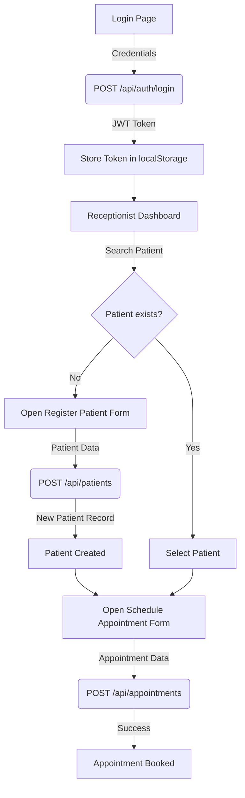
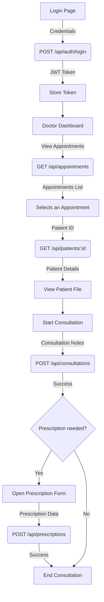

# Frontend Development Guide for ERP System

This document outlines the frontend architecture, API integration, and UI/UX guidelines for the ERP system. It is intended for frontend developers to understand the backend services and build a corresponding user interface.

## 1. Frontend Architecture (React & Plain JavaScript)

The frontend will be built using **React** and **plain JavaScript**. This approach provides a robust, component-based structure without the overhead of additional libraries like TypeScript or Axios.

- **Framework:** React
- **Language:** JavaScript (ES6+)
- **API Communication:** `fetch` API (native to the browser)
- **Component Library:** A simple, custom component library will be built to ensure a consistent look and feel.
- **Routing:** `react-router-dom` for navigation.
- **Build Tools:** Vite or Create React App.

## 2. API Integration Manual

The backend provides a RESTful API. All API endpoints are prefixed with `/api`.

### Detailed Connection Guide

Here’s how to connect to the backend API using plain JavaScript's `fetch`.

**Step 1: Create an API Utility File**

Create a file named `src/utils/api.js` to centralize all API communication logic.

```javascript
// src/utils/api.js

const BASE_URL = 'http://localhost:5000/api'; // Adjust if your backend runs elsewhere

// Function to get the JWT from localStorage
const getToken = () => localStorage.getItem('token');

// Main function to handle API requests
export const apiFetch = async (path, options = {}) => {
  const token = getToken();
  const headers = {
    'Content-Type': 'application/json',
    ...options.headers,
  };

  if (token) {
    headers['Authorization'] = `Bearer ${token}`;
  }

  const response = await fetch(`${BASE_URL}${path}`, {
    ...options,
    headers,
  });

  if (!response.ok) {
    // Handle HTTP errors
    const errorData = await response.json().catch(() => ({ message: 'An unknown error occurred' }));
    throw new Error(errorData.message || `HTTP error! status: ${response.status}`);
  }

  return response.json();
};
```

**Step 2: Implement Authentication**

In a file like `src/services/authService.js`, use `apiFetch` to handle login and registration.

```javascript
// src/services/authService.js
import { apiFetch } from '../utils/api';

export const login = async (email, password) => {
  const data = await apiFetch('/auth/login', {
    method: 'POST',
    body: JSON.stringify({ email, password }),
  });
  // Store the token
  if (data.token) {
    localStorage.setItem('token', data.token);
  }
  return data;
};

export const register = async (userData) => {
  return await apiFetch('/auth/register', {
    method: 'POST',
    body: JSON.stringify(userData),
  });
};

export const logout = () => {
  localStorage.removeItem('token');
};
```

**Step 3: Fetching Protected Data**

Now, you can easily fetch data from protected endpoints.

```javascript
// Example: In a React component
import { apiFetch } from '../utils/api';

const fetchPatients = async () => {
  try {
    const patients = await apiFetch('/patients');
    console.log(patients);
  } catch (error) {
    console.error('Failed to fetch patients:', error.message);
  }
};
```

### API Endpoints Summary

| Resource | Path | Method | Description |
| :--- | :--- | :--- | :--- |
| **Auth** | `/api/auth/register` | `POST` | Register a new user |
| | `/api/auth/login` | `POST` | Login a user |
| **Users** | `/api/users` | `GET`, `POST` | Manage users (Admin only) |
| | `/api/users/:id` | `GET`, `PUT`, `DELETE` | Manage a single user (Admin only) |
| **Roles** | `/api/roles` | `GET` | Get all roles (Admin only) |
| | `/api/roles/:id` | `GET` | Get a single role (Admin only) |
| **Patients** | `/api/patients` | `GET`, `POST` | Manage patients |
| | `/api/patients/:id` | `GET`, `PUT`, `DELETE` | Manage a single patient |
| **Appointments** | `/api/appointments` | `GET`, `POST` | Manage appointments |
| | `/api/appointments/:id` | `GET`, `PUT`, `DELETE` | Manage a single appointment |
| **Billing** | `/api/billing` | `GET`, `POST` | Manage bills |
| | `/api/billing/:id` | `GET`, `PUT`, `DELETE` | Manage a single bill |
| **Consultations** | `/api/consultations` | `GET`, `POST` | Manage consultations |
| **Departments** | `/api/departments` | `GET`, `POST` | Manage departments |
| | `/api/departments/:id` | `GET`, `PUT`, `DELETE` | Manage a single department |
| **Prescriptions** | `/api/prescriptions` | `GET`, `POST` | Manage prescriptions |
| | `/api/prescriptions/:id` | `GET`, `PUT`, `DELETE` | Manage a single prescription |
| **Staff** | `/api/staff` | `GET`, `POST` | Manage staff |
| | `/api/staff/:id` | `GET`, `PUT`, `DELETE` | Manage a single staff member |

## 3. Role-Based UI/UX Blueprints

The UI should be tailored to the user's role.

### Admin Dashboard
- **User Management:** A table to view, create, edit, and delete users.
- **Role Management:** A view to see all available roles.
- **Department Management:** A table to view, create, edit, and delete departments.
- **Staff Management:** A table to view, create, edit, and delete staff members.
- **System Analytics:** Charts and graphs showing key metrics.

### Doctor Dashboard
- **My Appointments:** A calendar or list view of today's and upcoming appointments.
- **Patient Lookup:** A search feature to find patient records.
- **Patient File:** A detailed view of a patient's history.
- **Start Consultation:** A form to record consultation notes.
- **Create Prescription:** A form to create a new prescription.

### Receptionist Dashboard
- **Patient Registration:** A form to register new patients.
- **Appointment Scheduling:** A calendar to book, reschedule, and cancel appointments.
- **Patient Search:** A search feature to find patients.
- **Billing:** A view to create and manage patient bills.

## 4. Reusable Component Library

Create a library of reusable components in `src/components`:
- `Button.js`
- `Input.js`
- `Table.js`
- `Modal.js`
- `DatePicker.js`
- `Select.js`
- `Card.js`
- `Navbar.js`
- `Sidebar.js`

## 5. Application State Management

Use React's built-in **Context API** and the `useState` and `useReducer` hooks for state management. This avoids external dependencies for simple to moderately complex state.

- **AuthContext:** To store the current user and token.
- **PatientContext:** To manage patient data across different components.

## 6. Detailed User Flow Diagrams

### Patient Registration and Appointment Booking (Receptionist)



### Doctor Consultation Flow



## 7. Instructions for Automated Frontend Generation

This document, in conjunction with `README.md`, provides a comprehensive blueprint for generating the frontend application.

**To the AI Agent:**

1.  **Framework:** Use **React** with plain **JavaScript**.
2.  **File Structure:** Create a standard React project structure (`src`, `components`, `pages`, `utils`, `services`).
3.  **API Layer:** Implement the `api.js` utility as described in Section 2.
4.  **Authentication:** Create the `authService.js` and build the login/registration pages.
5.  **Routing:** Use `react-router-dom` to create routes for each page/dashboard.
6.  **Dashboards:** For each role (Admin, Doctor, Receptionist), create a dashboard page that implements the features outlined in Section 3.
7.  **Components:** Build the reusable components listed in Section 4.
8.  **State Management:** Use the React Context API for managing shared state like authentication.
9.  **User Flows:** Follow the detailed Mermaid diagrams to implement the application's logic and API calls.

By following these instructions, you can automatically generate a functional frontend that correctly interfaces with the existing backend.